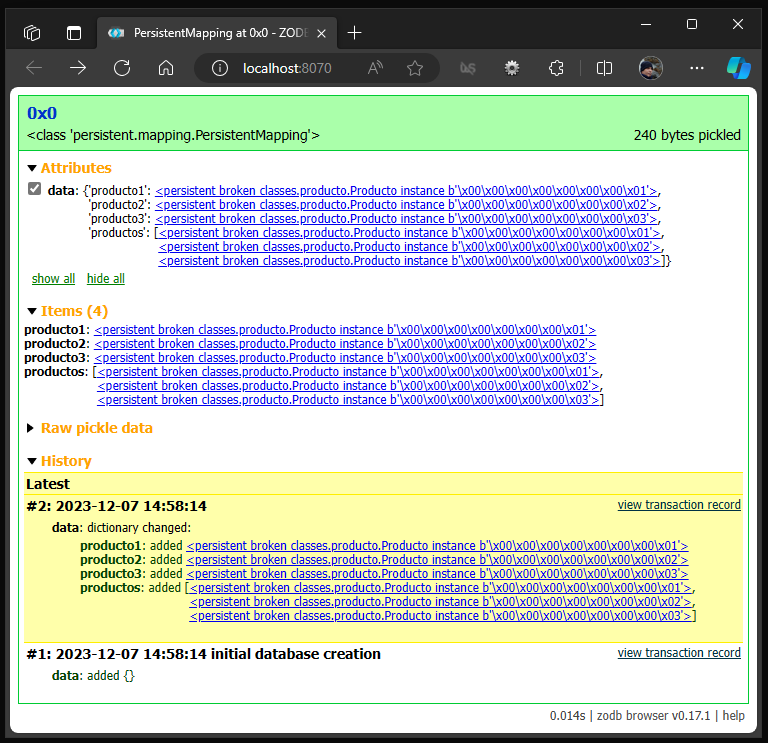

.. _python_zodb:

ZODB
====

La ZODB es una base de datos de objetos. Hace que sea muy fácil almacenar diferentes tipos
de datos de contenido en un gráfico, lo que admite subclases (algo que SQL a menudo hace mal).

Dado que la base de datos almacena objetos y los objetos están definidos en código Python,
siempre necesitará el código fuente Python correspondiente para crear instancias de los objetos
almacenados dentro de ZODB. Esto puede parecer incómodo al principio, pero necesita tener MySQL
ejecutándose para leer lo que hay dentro de los archivos MySQL almacenados en su disco, etc.

.. warning::
    La base de datos ZODB no se puede utilizar sin el código fuente de Python utilizado para crear
    los datos. Los datos no se pueden leer con ninguna herramienta basada en SQL y existen pequeñas
    herramientas para manejar los datos sin procesar.

.. _python_pkg_zodb_instalar:

Instalación
-----------

Para instalar el paquete `ZODB`_ ejecute el siguiente comando, el cual
a continuación se presentan el correspondiente comando de tu sistema operativo:

.. tabs::

   .. group-tab:: Linux

      .. code-block:: console

          $ pip install ZODB

   .. group-tab:: Windows

      .. code-block:: console

          > pip install ZODB

Puede probar si la instalación se realizo correctamente, ejecutando
el siguiente comando correspondiente a tu sistema operativo:

.. tabs::

   .. group-tab:: Linux

      .. code-block:: console

          $ python -c "import ZODB ; print(ZODB.__package__)"

   .. group-tab:: Windows

      .. code-block:: console

          > python -c "import ZODB ; print(ZODB.__package__)"

Si muestra el numero de la versión instalada de ``ZODB``, tiene
correctamente instalada la paquete. Con esto, ya tiene todo listo para continuar.

Adicionalmente puedes instalar un cliente de base de datos ZODB, a continuación se
presentan alternativas:

ZODB browser
^^^^^^^^^^^^

El ZODB browser le permite inspeccionar objetos persistentes almacenados en ZODB,
ver sus atributos y los cambios históricos realizados en ellos.

Es un paquete de herramientas de línea de comandos para administrar archivos
de base de datos ZODB, incluido el programa :command:`zodbbrowser.exe` para la
shell de línea de comandos.

Para instalar el administrador de base de datos ZODB ``ZODB browser`` de
forma nativa para sistemas operativos Linux y Windows, a continuación se presentan
los modos de instalación:

.. tabs::

   .. group-tab:: Linux

      .. code-block:: console

          $ pip install zodbbrowser==0.17.1

   .. group-tab:: Windows

      .. code-block:: console

          > pip install zodbbrowser==0.17.1

Puede probar si la instalación se realizo correctamente, ejecutando
el siguiente comando:

.. tabs::

   .. group-tab:: Linux

      Puede probar si la instalación se realizo correctamente, ejecutando
      el siguiente comando:

      .. code-block:: console

          > zodbbrowser --help
          Usage: zodbbrowser [options] [FILENAME | --zeo ADDRESS]

          Open a ZODB database and start a web-based browser app.

          Options:
            -h, --help        show this help message and exit
            --zeo=ADDRESS     connect to ZEO server instead (host:port or socket name)
            --storage=NAME    connect to given ZEO storage
            --listen=ADDRESS  specify port (or host:port) to listen on
            -q, --quiet       be quiet
            --debug           enable debug logging
            --rw              open the database read-write (default: read-only)

      Si tiene disponibles el comando ``zodbbrowser``, tiene correctamente instalada el cliente
      de base de datos nativa ``ZODB`` por linea de comando.

      .. note::

        Mas información consulte https://pypi.org/project/zodbbrowser/

   .. group-tab:: Windows

      Puede probar si la instalación se realizo correctamente, ejecutando
      el siguiente comando:

      .. code-block:: console

          > zodbbrowser.exe --help
          Usage: zodbbrowser [options] [FILENAME | --zeo ADDRESS]

          Open a ZODB database and start a web-based browser app.

          Options:
            -h, --help        show this help message and exit
            --zeo=ADDRESS     connect to ZEO server instead (host:port or socket name)
            --storage=NAME    connect to given ZEO storage
            --listen=ADDRESS  specify port (or host:port) to listen on
            -q, --quiet       be quiet
            --debug           enable debug logging
            --rw              open the database read-write (default: read-only)

      Si tiene disponibles el comando ``zodbbrowser``, tiene correctamente instalada el cliente
      de base de datos nativa ``ZODB`` por linea de comando.

      .. note::

        Mas información consulte https://pypi.org/project/zodbbrowser/

Ejecute el comando ``zodbrowser`` especificando un nombre de archivo ZODB, ejecutando el siguiente comando:

.. tabs::

   .. group-tab:: Linux

      .. code-block:: console

          $ zodbbrowser /ruta/al/archivo/Data.fs

   .. group-tab:: Windows

      .. code-block:: console

          > zodbbrowser.exe C:\Ruta\al\archivo\Data.fs

El comando anterior muestra el siguiente mensaje:

.. code-block:: console

    Listening on http://localhost:8070/

Abra http://localhost:8070 en un navegador web. Tenga en cuenta que no hay controles
de acceso; todos los demás usuarios de la máquina local podrán acceder al contenido
de la base de datos.

Al abrir la dirección anterior debería mostrar la interfaz gráfica de ``zodbbrowser``, como se muestra
a continuación:

    ZODB browser

Si muestra la interfaz gráfica de ``zodbbrowser``, tiene correctamente instalada el cliente
de base de datos ``ZODB``.

.. _python_zodb_conn_strs:

Cadenas de conexión
-------------------

Para definir el método ``connect`` debe definir las cadenas de conexión con
``ZODB`` como se describe a continuación:

``DB_PATH``
    Ruta absoluta o relativa del archivo de base de datos ``ZODB``.

``DB_FILE``
    Nombre del archivo de base de datos ``ZODB``.

A continuación presento un ejemplo en Python implementando una cadena de conexión
para una base de datos ``ZODB``:

.. code-block:: python
    :linenos:

    import os
    import persistent
    import transaction
    import ZODB, ZODB.FileStorage
    from pathlib import Path

    DB_PATH = os.path.dirname(os.path.abspath(__file__)) + os.sep + "filestorage/"
    Path(DB_PATH).mkdir(parents=True, exist_ok=True)
    DB_FILE = ZODB.FileStorage.FileStorage(DB_PATH + "productos.fs")
    DB = ZODB.DB(DB_FILE)

    connection = DB.open()

El ejemplo anterior se describe a continuación:

    - En la linea 1, se importa la librería ``os`` de la librería estándar Python.

    - En la linea 2, se importa la librería ``ZODB`` de la librería estándar Python.

    - En la linea 4, se define en la constante ``DB_PATH`` la ruta absoluta usada para guardar la base de datos.

    - En la linea 5, se define en la constante ``DB_FILE`` el nombre de la base de datos.

    - En la linea 6, se define en la constante ``DB`` la ruta completa usada para leer la base de datos.

De esta forma se crea una cadena de conexión para ``ZODB`` para ser usada por el método ``open``.

----

Insertar registros
------------------

Si requiere insertar registro en una tabla, a continuación tiene un ejemplo:

.. literalinclude:: ../../recursos/leccion2/zodb/crud/zodb_record_insert.py
    :language: python
    :linenos:
    :lines: 1-87

----

.. important::
    Usted puede descargar el código usado en esta sección haciendo clic en el
    siguiente enlace: :download:`zodb_record_insert.py <../../recursos/leccion2/zodb/crud/zodb_record_insert.py>`.

.. tip::
    Para ejecutar el código :file:`zodb_record_insert.py`
    abra una consola de comando, acceda al directorio donde se encuentra el programa:

    ::

        leccion2/
            └── zodb/
                └── zodb_record_insert.py

    Si tiene la estructura de archivo previa, entonces ejecute el siguiente comando:

    .. code-block:: console

        $ python zodb_record_insert.py

El anterior código al ejecutar debe mostrar el siguiente mensaje:

.. code-block:: console

    INFO:root:¡Conectado a la base de datos productos.fs!

    INFO:root:¡Fueron insertado(s) los registro(s) correctamente en la ZODB!

    INFO:root:¡La conexión ZODB a la base de datos productos.fs fue cerrada!

----

Consultar registros
-------------------

Si requiere consultar registros de tabla, a continuación tiene un ejemplo:

.. literalinclude:: ../../recursos/leccion2/zodb/crud/zodb_record_read.py
    :language: python
    :linenos:
    :lines: 1-56

----

.. important::
    Usted puede descargar el código usado en esta sección haciendo clic en el
    siguiente enlace: :download:`zodb_record_read.py <../../recursos/leccion2/zodb/crud/zodb_record_read.py>`.

.. tip::
    Para ejecutar el código :file:`zodb_record_read.py`
    abra una consola de comando, acceda al directorio donde se encuentra el programa:

    ::

        leccion2/
            └── zodb/
                └── zodb_record_read.py

    Si tiene la estructura de archivo previa, entonces ejecute el siguiente comando:

    .. code-block:: console

        $ python zodb_record_read.py

El anterior código al ejecutar debe mostrar el siguiente mensaje:

.. code-block:: console

    INFO:root:¡Conectado a la base de datos sistema.db!

    Total de filas son: 3

    Mostrar cada fila:

            Id: 1
            Nombre: Leonardo
            Código postal: Caballero
            Teléfono: 5001

            Id: 2
            Nombre: Ana
            Código postal: Poleo
            Teléfono: 6302

            Id: 3
            Nombre: Pedro
            Código postal: Lopez
            Teléfono: 4001

    INFO:root:¡La conexión ZODB a la base de datos sistema.db fue cerrada!

----

Actualizar registros
--------------------

Si requiere actualizar registro de tabla, a continuación tiene un ejemplo:

.. literalinclude:: ../../recursos/leccion2/zodb/crud/zodb_record_update.py
    :language: python
    :linenos:
    :lines: 1-58

----

.. important::
    Usted puede descargar el código usado en esta sección haciendo clic en el
    siguiente enlace: :download:`zodb_record_update.py <../../recursos/leccion2/zodb/crud/zodb_record_update.py>`.

.. tip::
    Para ejecutar el código :file:`zodb_record_update.py`
    abra una consola de comando, acceda al directorio donde se encuentra el programa:

    ::

        leccion2/
            └── zodb/
                └── zodb_record_update.py

    Si tiene la estructura de archivo previa, entonces ejecute el siguiente comando:

    .. code-block:: console

        $ python zodb_record_update.py

El anterior código al ejecutar debe mostrar el siguiente mensaje:

.. code-block:: console

    INFO:root:¡Conectado a la base de datos sistema.db!

    INFO:root:¡Fueron actualizado(s) 2 registro(s) correctamente en la tabla!

    INFO:root:¡La conexión ZODB a la base de datos sistema.db fue cerrada!

----

Eliminar registros
------------------

Si requiere eliminar registro de tabla, a continuación tiene un ejemplo:

.. literalinclude:: ../../recursos/leccion2/zodb/crud/zodb_record_delete.py
    :language: python
    :linenos:
    :lines: 1-55

----

.. important::
    Usted puede descargar el código usado en esta sección haciendo clic en el
    siguiente enlace: :download:`zodb_record_delete.py <../../recursos/leccion2/zodb/crud/zodb_record_delete.py>`.

.. tip::
    Para ejecutar el código :file:`zodb_record_delete.py`
    abra una consola de comando, acceda al directorio donde se encuentra el programa:

    ::

        leccion2/
            └── zodb/
                └── zodb_record_delete.py

    Si tiene la estructura de archivo previa, entonces ejecute el siguiente comando:

    .. code-block:: console

        $ python zodb_record_delete.py

El anterior código al ejecutar debe mostrar el siguiente mensaje:

.. code-block:: console

    INFO:root:¡Conectado a la base de datos sistema.db!

    INFO:root:¡Registro eliminado correctamente!

    INFO:root:¡La conexión ZODB a la base de datos sistema.db fue cerrada!

Asi de esta forma puede ingresar, consultar, actualizar y eliminar
registro en una tabla en una base de datos ``ZODB``.

----

.. _python_zodb_scaffolding:

Práctica - Caso real
--------------------

A continuación se presenta una práctica más real de implementar el uso de proyectos
con ``ZODB``, a continuación la estructura de proyecto llamado ``zodb``:

.. code-block:: console

    zodb/
    └── sistema/
        ├── classes/
        │   ├── __init__.py
        │   └── producto.py
        ├── filestorage
        │   ├── inventario.fs
        │   ├── inventario.fs.index
        │   ├── inventario.fs.lock
        │   └── inventario.fs.tmp
        ├── __init__.py
        ├── main.py
        ├── requirements.txt
        └── settings.py

A continuación se presenta y explica el uso de cada archivo para este proyecto:

*Archivo producto.py*

Modulo de configuraciones del programa.

.. literalinclude:: ../../recursos/leccion2/zodb/sistema/classes/producto.py
    :language: python
    :linenos:
    :lines: 1-25

*Archivo main.py*

Modulo de configuraciones del programa.

.. literalinclude:: ../../recursos/leccion2/zodb/sistema/main.py
    :language: python
    :linenos:
    :lines: 1-31

*Archivo settings.py*

Modulo de configuraciones del programa.

.. literalinclude:: ../../recursos/leccion2/zodb/sistema/settings.py
    :language: python
    :linenos:
    :lines: 1-12

*Archivo inventario.fs*

Archivo de base de datos de :ref:`ZODB <python_zodb>` llamado :file:`inventario.fs`
la cual no se incluye ya que cada vez que se inicia el programa :file:`main.py` se elimina y crea
nuevamente, para cuidar la creación de los datos iniciales.

*Archivo requirements.txt*

Archivo de `requirements.txt`_ de la herramienta de gestión de paquetes `pip`_.

.. literalinclude:: ../../recursos/leccion2/zodb/sistema/requirements.txt
    :language: python
    :linenos:
    :lines: 1-3

Teniendo creada la anterior estructura de proyecto, vuelva a ejecutar ahora el modulo con
el siguiente comando, el cual a continuación se presentan el correspondiente comando de tu
sistema operativo:

.. tabs::

   .. group-tab:: Linux

      Antes de ejecutar debes instalar sus dependencias, con el siguiente comando:

      .. code-block:: console

          $ pip install -r requirements.txt

      .. tip::
        Para ejecutar el código fuente de esta practica debe invocar al modulo :file:`main.py`,
        abra una consola de comando, acceda al directorio donde se encuentra la estructura previa
        y ejecute el siguiente comando:

      .. code-block:: console

          $ python main.py

   .. group-tab:: Windows

      Antes de ejecutar debes instalar sus dependencias, con el siguiente comando:

      .. code-block:: console

          > pip install -r requirements.txt

      .. tip::
        Para ejecutar el código fuente de esta practica debe invocar al modulo :file:`main.py`,
        abra una consola de comando, acceda al directorio donde se encuentra la estructura previa
        y ejecute el siguiente comando:

      .. code-block:: console

          > python main.py

El anterior código al ejecutar debe mostrar el siguiente mensaje:

.. code-block:: console

    ItemsView({'producto1': Producto:(1, Carro), 'producto2': Producto:(2, Moto), 'producto3': Producto:(3, Bicicleta), 'productos': [Producto:(1, Carro), Producto:(2, Moto), Producto:(3, Bicicleta)]})
    Id: 1
    Descripción: Camioneta
    Camioneta

Asi de esta forma puede ingresar, consultar y actualizar registro en un archivo
serializado de objetos python ``ZODB``.

----

.. seealso::

    Consulte la sección de :ref:`lecturas suplementarias <lecturas_extras_leccion2>`

.. raw:: html
   :file: ../_templates/partials/soporte_profesional.html

.. _`pickle`: https://docs.python.org/es/3.11/library/pickle.html
.. _`ZODB`: https://zodb.org/en/latest/
.. _`requirements.txt`: https://pip.pypa.io/en/stable/reference/requirements-file-format/
.. _`pip`: https://pip.pypa.io/en/stable/
