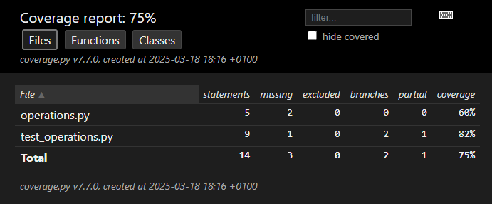
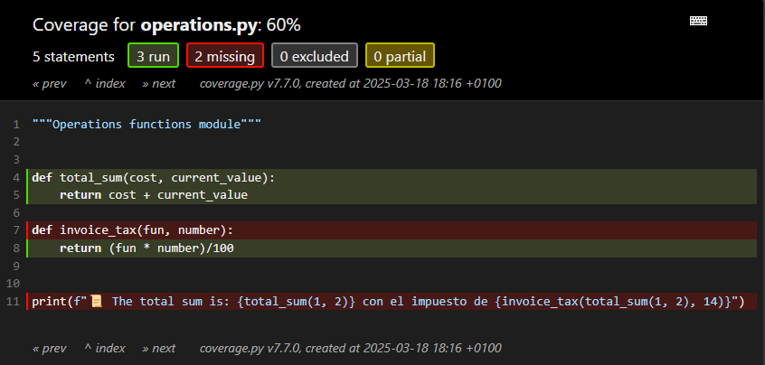

.. _python_test_code_coverage_measurement:

Cobertura del código
====================

La medición de la cobertura de código es una medida (porcentual) en las pruebas de software que mide el grado
en que el código fuente de un programa ha sido comprobado con pruebas de software. Sirve para determinar la
calidad del test que se lleve a cabo1​ y para determinar las partes críticas del código que no han sido comprobadas
y las partes que ya lo fueron, además se puede utilizar como técnica de optimización dentro de un compilador
optimizador para llevar a cabo una eliminación de código muerto, más específicamente sirve para detectar código
fuente inalcanzable

.. tip::
    La cobertura de código fue uno de los primeros métodos inventados para las pruebas de software sistemáticas.

----

.. _python_test_modulo_coverage:

Módulo coverage
---------------

.. note::
    **Propósito:** usar la herramienta que incorpora la medición de la cobertura de código fuente para Python.

El módulo `coverage`_ es una herramienta para medir la cobertura de código de los programas Python. Supervisa
el programa, anotando qué partes del código se han ejecutado y, a continuación, analiza el código fuente para
identificar el código que podría haberse ejecutado pero no se hizo.

La medición de la cobertura se utiliza normalmente para medir la eficacia de las pruebas. Puede mostrar qué
partes de su código están siendo ejercitadas por las pruebas, y cuáles no.

----

.. _python_test_modulo_coverage_instalar:

Instalación
-----------

Al realizar la medición de la cobertura de código necesita la herramienta `coverage`_. Esto significa que
debe instalar ``coverage`` ejecutando los siguientes comandos correspondiente a cada sistema operativo, los cuales se
presentan a continuación:

.. tabs::

   .. group-tab:: Linux

      Para realizar la medición de la cobertura de código de una aplicación con ``coverage`` requiere
      instalar las siguientes librerías/módulos:

      #. :ref:`Entorno de desarrollo <python_entorno_desarrollo>`.

      #. :ref:`Python package installer - pip <python_entorno_desarrollo_pip>`.

      #. :ref:`Entorno virtual Python <python_entorno_desarrollo_venv>`.

      #. Instalar la herramienta ``coverage``, ejecutando el siguiente comando:

         .. code-block:: console

             pip3 install coverage

   .. group-tab:: Windows

      #. :ref:`Entorno virtual Python <python_entorno_desarrollo_venv>`.

      #. Instalar la herramienta ``coverage``, ejecutando el siguiente comando:

         .. code-block:: console

             pip3 install coverage

Puede probar si la instalación se realizo correctamente, ejecutando
el siguiente comando correspondiente a tu sistema operativo:

.. tabs::

   .. group-tab:: Linux

      .. code-block:: console

          coverage --version

   El anterior comando al ejecutar debe mostrar algo pareciedo al siguiente mensaje:

      .. code-block:: console

          Coverage.py, version 7.7.0 with C extension
          Full documentation is at https://coverage.readthedocs.io/en/7.7.0

   .. group-tab:: Windows

      .. code-block:: console

          coverage --version

   El anterior comando al ejecutar debe mostrar algo pareciedo al siguiente mensaje:

      .. code-block:: console

          Coverage.py, version 7.7.0 with C extension
          Full documentation is at https://coverage.readthedocs.io/en/7.7.0

Si muestra el número de la versión instalada de ``coverage``, tiene correctamente instalado
el módulo. Con esto, ya tiene todo listo para continuar.

----

.. _python_test_modulo_coverage_scaffolding:

Práctica - Caso real
--------------------

A continuación se presenta una práctica más real de implementar el uso de proyectos
con ``coverage``, a continuación la estructura de proyecto llamado ``coverage``:

Estructura de archivos
^^^^^^^^^^^^^^^^^^^^^^

Para crear la estructura de archivos del proyecto ``coverage`` debe ejecutar los siguientes comandos:

.. tabs::

   .. group-tab:: Linux

      Crear y acceder al directorio ``coverage`` en un solo comando, ejecutando el siguiente comando:

      .. code-block:: console

          mkdir -p ~/proyectos/pruebas/coverage && cd $_

      El comando anterior crea la siguiente estructura de directorios:

      .. code-block:: console
          :class: no-copy

          proyectos/
          └── pruebas/
              └── coverage/

      Si tiene la estructura de archivo previa, entonces puede continuar con la siguiente sección.

   .. group-tab:: Windows

      Debe crear el directorio ``coverage``, ejecutando el siguiente comando:

      .. code-block:: console

          md .\proyectos\pruebas\coverage

      Debe acceder al directorio, ejecutando el siguiente comando:

      .. code-block:: console

          cd .\proyectos\pruebas\coverage

      El comando anterior crea la siguiente estructura de directorios:

      .. code-block:: console
          :class: no-copy

          proyectos/
          └── pruebas/
              └── coverage/

      Si tiene la estructura de archivo previa, entonces puede continuar con la siguiente sección.

A continuación se presenta y explica el uso de cada archivo para este proyecto:

*Archivo* :file:`.coveragerc`

Archivo de configuración de la herramienta ``coverage``.

.. code-block:: cfg
    :linenos:

    # .coveragerc to control coverage.py
    [run]
    branch = True
    omit = */venv/*

    [report]
    # Regexes for lines to exclude from consideration
    exclude_lines =
        # Have to re-enable the standard pragma
        pragma: no cover

        # Don't complain about missing debug-only code:
        def __repr__
        if self\.debug

        # Don't complain if tests don't hit defensive assertion code:
        raise AssertionError
        raise NotImplementedError

        # Don't complain if non-runnable code isn't run:
        if 0:
        # if __name__ == .__main__.:

        # Don't complain about abstract methods, they aren't run:
        @(abc\.)?abstractmethod

*Archivo* :file:`operations.py`

Módulo de funciones operativas del programa.

.. code-block:: python
    :linenos:

    """Operations functions module"""

    def invoice_tax(cost_total, tax_number):
        return (cost_total * tax_number)/100

    def total_sum(cost, current_value):
        return cost + current_value

    print(f"📜 The total sum is: {total_sum(1, 2)} con el impuesto de {invoice_tax(total_sum(1, 2), 14)}")

*Archivo* :file:`test_operations.py`

Módulo de pruebas unitarias funciones operativas del programa.

.. code-block:: python
    :linenos:

    """Unit test using unittest for operations.py module"""

    import unittest
    from operations import total_sum

    class TestSumFunction(unittest.TestCase):
        """Unit test of total_sum function"""

        def test_total_sum_positive(self):
            """Test total sum positive"""
            self.assertEqual(total_sum(1, 2), 3)

        def test_total_sum_negative(self):
            """Test total sum negative"""
            self.assertEqual(total_sum(-2, -3), -5)

    if __name__ == "__main__":
        unittest.main()

----

Para ejecutar el código del proyecto llamado ``coverage`` abra una consola de comando, cree la
siguiente estructura de directorio y acceda al mismo donde se encuentra el programa:

.. code-block:: console
    :class: no-copy

    proyectos/
    └── pruebas/
        └── coverage/
            ├── .coveragerc
            ├── __init__.py
            ├── operations.py
            └── test_operations.py

Si tiene la estructura de archivo previa, entonces puede continuar los procesos de ejecución del
código fuente.

----

Teniendo creada la anterior estructura de proyecto, vuelva a ejecutar ahora el módulo con
el siguiente comando, el cual a continuación se presentan el correspondiente comando de tu
sistema operativo:

Ejecute sus pruebas con ``coverage``, ejecutando el siguiente comando:

.. code-block:: console

    coverage run -m unittest discover

El anterior comando al ejecutar debe mostrar algo pareciedo al siguiente mensaje:

.. code-block:: console
    :class: no-copy

    📜 The total sum is: 3 con el impuesto de 0.42
    ...
    ----------------------------------------------------------------------
    Ran 2 tests in 0.000s

    OK

Generar un informe por linea de comando de la herramienta ``coverage``, ejecutando el siguiente comando:

.. code-block:: console

    coverage report -m

El anterior comando al ejecutar debe mostrar el siguiente mensaje:

.. code-block:: console
    :class: no-copy

    Name                 Stmts   Miss Branch BrPart  Cover   Missing
    ----------------------------------------------------------------
    operations.py            5      2      0      0    60%   8, 12
    test_operations.py       9      1      2      1    82%   24
    ----------------------------------------------------------------
    TOTAL                   14      3      2      1    75%

Generar un informe HTML de la herramienta ``coverage``, ejecutando el siguiente comando:

.. code-block:: console

    coverage html

El anterior comando al ejecutar debe mostrar el siguiente mensaje:

.. code-block:: console
    :class: no-copy

    Wrote HTML report to htmlcov/index.html

Para visualizar el reporte HTML generado, abra el archivo :file:`index.html` ubicado en la carpeta
:file:`htmlcov` que se encuentra en la carpeta donde se encuentra el módulo :file:`operations.py`.

    Índice de reporte coverage

    Detalle de reporte coverage de un módulo

Hay dos (02) tareas que se pueden realizar para mejorar la cobertura de código:

1) Para corregir la cobertura de pruebas en el módulo :file:`operations.py` en la *linea 8*, agregue el siguiente código
   fuente el módulo :file:`test_operations.py`

   .. code-block:: python
       :linenos:

       """Unit test using unittest for operations.py module"""

       import unittest
       from operations import invoice_tax, total_sum

       class TestSumFunction(unittest.TestCase):
           """Unit test of total_sum function"""

           def test_total_sum_positive(self):
               """Test total sum positive"""
               self.assertEqual(total_sum(1, 2), 3)

           def test_total_sum_negative(self):
               """Test total sum negative test"""
               self.assertEqual(total_sum(-2, -3), -5)

           def test_invoice_tax_positive(self):
               """Invoice tax test"""
               self.assertEqual(invoice_tax(total_sum(1, 2), 14), 0.42)

       if __name__ == "__main__":
           unittest.main()

   Vuelva a ejecutar sus pruebas con ``coverage``, ejecutando el siguiente comando:

   .. code-block:: console

       coverage run -m unittest discover

   El anterior comando al ejecutar debe mostrar algo pareciedo al siguiente mensaje:

   .. code-block:: console
       :class: no-copy

       📜 The total sum is: 3 con el impuesto de 0.42
       ...
       ----------------------------------------------------------------------
       Ran 3 tests in 0.000s

       OK

   Vuelva a generar un informe por linea de comando de la herramienta ``coverage``, ejecutando
   el siguiente comando:

   .. code-block:: console

       coverage report -m

   El anterior comando al ejecutar debe mostrar el siguiente mensaje:

   .. code-block:: console
       :class: no-copy

       Name                 Stmts   Miss Branch BrPart  Cover   Missing
       ----------------------------------------------------------------
       operations.py            5      0      0      0   100%
       test_operations.py      11      1      2      1    85%   24
       ----------------------------------------------------------------
       TOTAL                   16      1      2      1    89%

   De esta forma aplico cobertura de pruebas unitarias al módulo :file:`operations.py`.

2) Para corregir la cobertura de pruebas en el módulo :file:`test_operations.py` en la *linea 24*, agregue el
   siguiente código fuente el archivo :file:`.coveragerc`, remplacendo el contenido del archivo por el siguiente:

   .. literalinclude:: ../../recursos/leccion9/coverage/.coveragerc
       :language: cfg
       :linenos:
       :lines: 1-24

   Vuelva a generar un informe por linea de comando de la herramienta ``coverage``, ejecutando
   el siguiente comando:

   .. code-block:: console

       coverage report -m

   El anterior comando al ejecutar debe mostrar el siguiente mensaje:

   .. code-block:: console
       :class: no-copy

       Name                 Stmts   Miss Branch BrPart  Cover   Missing
       ----------------------------------------------------------------
       operations.py            5      0      0      0   100%
       test_operations.py       9      0      0      0   100%
       ----------------------------------------------------------------
       TOTAL                   14      0      0      0   100%

   De esta forma aplico cobertura de pruebas unitarias al módulo :file:`test_operations.py`.

   Puede volver a generar un informe HTML de la herramienta ``coverage``, ejecutando el siguiente
   comando:

   .. code-block:: console

       coverage html

   El anterior comando al ejecutar debe mostrar el siguiente mensaje:

   .. code-block:: console
       :class: no-copy

       Wrote HTML report to htmlcov/index.html

   Puede volver a visualizar el reporte HTML generado, abra el archivo :file:`index.html` ubicado en la carpeta
   :file:`htmlcov` que se encuentra en la carpeta donde se encuentra el módulo :file:`operations.py`.

   .. figure:: ../_static/images/coverage_index_successful.png
       :align: center
       :width: 80%

       Índice de reporte coverage completado

   .. figure:: ../_static/images/coverage_details_successful.png
       :align: center
       :width: 80%

       Detalle de reporte coverage de un módulo completado

   Así de esta forma puede replicar una práctica real de un proyecto para realizar cobertura de código fuente,
   usando la herramienta ``coverage`` para el módulo :file:`operations.py`, aplicando buenas prácticas de código funcional.

.. important::
    Usted puede descargar el código usado en esta sección haciendo clic en los
    siguientes enlaces:

    - :download:`.coveragerc <../../recursos/leccion9/coverage/.coveragerc>`.

    - :download:`operations.py <../../recursos/leccion9/coverage/operations.py>`.

    - :download:`test_operations.py <../../recursos/leccion9/coverage/test_operations.py>`.

----

.. seealso::

    Consulte la sección de :ref:`lecturas suplementarias <lecturas_extras_leccion9>`
    del entrenamiento para ampliar su conocimiento en esta temática.

.. raw:: html
   :file: ../_templates/partials/soporte_profesional.html

..
  .. disqus::

.. _`coverage`: https://pypi.org/project/coverage/7.7.0/
